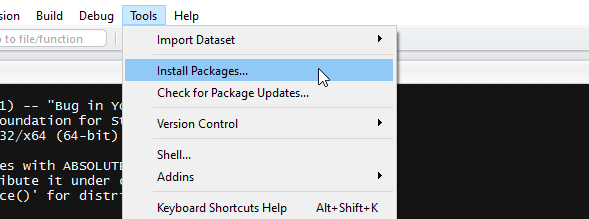

> "Most of my life I went to parties and heard a little groan when people heard what I did", says Robert Tibshirani, a statistics professor at Stanford University. "Now they're all excited to meet me. -- *New York Times* "


Is global warming real? Do NFL concussion spotters reduce the risk of long-term brain damage of players? Should I trust Yelp reviews on Nashville hot chicken restaurants? Do African swallows have higher air-speed velocity than European swallows on average? These questions share one thing in common: a good answer has to be accompanied with an analysis of relevant data. Statistics is the quantitative study of data, and data never had more influnce and impact in history than today. It is a good time to know statistics.

## About the course

There are two building blocks in statistics: hypothesis generation and hypothesis confirmation. What you learn in statistics lectures are often focused on the latter, especially on testing hypotheses and making statistical inferences. You may have heard of (don't worry if you have not) terms like p-value or confidence interval. The process of summarizing properties of data with numbers like p-value in order to test hypotheses is an essential ingredient of any introductory statistics course. Statistical inference is a diffucult but worthwhile subject to dive into. Yet in this lab, we will spend more time practicing hypothesis generation, or data exploration. How does my data behave and what kind of questions can I pose on my data? We will cover some basic steps in hypothesis generation so you can ask interesting question and apply the hypothesis confirmation knowledge you have.

Because it is a lab, you are expected to learn by doing. All the demonstrations in the lab will be done in the programming language R. If you are aboard the big data hype train, you may have heard names like Python or Julia, which we will not cover in the lab. The reason that all my lab notes will be written exclusively in R is not because Python and company are less powerful or less important than R, but simply because we have limited time. In my opinion, mastering one tool puts you in a better position to pick up another.

## Why R?

I can give you many reasons why we use R. For starters, R is free and open source, so whatever you have learned and worked on in this course, the knowledge and code are portable and will go with you wherever you go. Another great strength of R is the community behind it. Most of the R packages you are going to see in this course and beyond are developed by some very capable and active statisticians. Because statistics researchers talk to each other in the form of R packages, being an R user means access to state-of-the-art statistical tools before they are available in any other language.

As a programming language, R sets itself apart from others because R is a domain-specific language created to specialize in *doing* statistics. Many data tasks or statistical computations become one or two-liners in R. Let R handle the messy part, so the users can spend their time on actual analysis. 

## Example

At some point of my life I have wondered whether there is a name trend within U.S. in the last few decades, but did not have the data nor the toolkit to answer such question. After I learned R and discovered the [baby name dataset](https://github.com/hadley/babynames) provided by the U.S. Social Security Administration, I can do some analysis on name trends with just a few lines of code. For example, Donald (Don) seems to be a popular name for people born in the 50s but I have never met any Donald under 30, so maybe I can make a time-series plot on Donalds against other popular names to see if there is a trend.

```{r message=FALSE, warning=FALSE}
library(dplyr)
library(ggplot2)
library(babynames)
```

The SSA baby name dataset contains all registered information dating back to 1880. The first few rows of the  dataset looks like this.

```{r}
head(babynames::babynames)
```

I can then plot a scatterplot on some male first names,

```{r}
list.name <- c("Timothy","Donald","Benjamin")
plot.name <- ggplot(
  data = (babynames::babynames %>% filter(name %in% list.name, sex == "M")),
  aes(x = year, y = n, color = name)
)
plot.name + geom_point()
```

or fit a smoothing curve to the scatterplot.

```{r}
plot.name + geom_smooth()

```

Judging from the graphics, I conclude that there is a decline in Donalds and an increase in Benjamins in recent years, all with just a few lines of code. The decline in Timothys suprised me a little, but that's why making plots is helpful. Graphics help us find patterns or trends that we did not expect. *Then we can start forming a hypothesis.* In other words, this is an exploratory analysis of data, an important step in data analysis that we will come back to later.

## Install R and RStudio

To start using R, you have to first install core R from [CRAN repositories](https://cran.r-project.org/mirrors.html). The core installation includes an R user interface called RGui, which can be used to run R commands and scripts. However, in this course I will be demonstrating all R lab sessions with the free license version of a popular IDE called [RStudio](https://www.rstudio.com/home/). You can download RStudio from [here](https://www.rstudio.com/products/rstudio/download2/).

## Install packages

Packages in R are collections of functions and/or datasets that people compiled and released for others to use. One way to install packages is using Install Packages under the Tools tab in RStudio. 



The command line equivalent is the `install.packages()` function. We will be using the following packages throughout the course, so you should go ahead and install them now.

* devtools
* dplyr
* ggplot2
* rmarkdown
* tidyr
* broom
* caret

```{r, eval=FALSE}
pkgs <- c("devtools","dplyr","ggplot2","rmarkdown","tidyr","broom","caret")
install.packages(pkgs)
```

Once you installed the devtools package, you can also install packages from GitHub repositories with the `install_github()` function. For example, to get the package containing the baby name data above, run
```{r, eval=FALSE}
devtools::install_github("hadley/babynames")
```

### Loading
To use an installed package in current R session, you need to load packages with the `library()` function.
```{r, eval=FALSE}
library(ggplot2)
```

Note: Some people use `require()` to load a library, but you should always use `library()` as explained in [this blog post](https://yihui.name/en/2014/07/library-vs-require/)