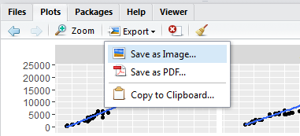

In this lab I will introduce a popular R package for graphics: ggplot2. To load a package into the current R session, use the `library()` function.

```{r}
library(ggplot2)
```

ggplot2 is a popular R package that provides an alternative graphics solution than R's base plotting functions. It is developed by Hadley Wickham based on idea from Leland Wilkinson's book, *The Grammer of Graphics.* We will quickly go through some plotting basics of by making some common plots used in data analysis.

### Dataset example: diamonds

There are some interesting datasets in the ggplot2 package that are good for practicing. R packages often comes with datasets and one can list the datasets contained in the package with the `data()` function.
```{r, eval = FALSE}
data(package="ggplot2")
```
Illustrations in this lab will be done with the `diamonds` dataset. We can load the dataset into environment by using `data()` again (after ggplot2 is loaded into the environment.) The `head()` function displays the first few rows of the dataset called.
```{r}
data(diamonds) 
head(diamonds, 5) # display 5 rows
```
What kind of information is contained in the data? You should read about the dataset by running either `help(diamonds)` or `?diamonds`. The first thing to note here is the dataset contains both continuous (carat, price) and [categorical variables](https://documents.software.dell.com/statistics/textbook/statistical-advisor/continuous-vs-categorical-data) (cut, color, clarity). Continuous variables and categorical variables should be treated very differently in statistical anaysis. The idea of continuous/categorical variable will be revisited when we get to exploratory analysis. Back to the `diamonds` data, I think the first question that most people have about diamonds can be summarized in the following plot.

```{r}
ggplot(data=diamonds, aes(x=carat, y=price)) + geom_point()
```

This is a scatterplot of two continuous variables, `price` against `carat`. We can also add a categorical variable `clarity` to the scatterplot.

```{r}
ggplot(data=diamonds, aes(x=carat, y=price, color=clarity)) + geom_point()
```

These are simple examples of ggplot2 graphics. You may be wondering how one makes different plots in ggplot2 now. Let's start with the rationale behind ggplot2 syntax.

### A layered grammar
According to Noam Chomsky, a grammer is a set of defined operations to produce new sentences from existing ones. ggplot2 constructs plots from basic objects called *layers* following the [Layered Grammer of Graphics](http://vita.had.co.nz/papers/layered-grammar.pdf). Each layer in ggplot2 is specified with four components:

  1. **Data and aesthetic mappings**
  2. **Geometric object (geom)**
  3. **Statistical transformation (stat)**
  4. **Position adjustment.**
  
Data, aesthetic mappings, and geometric objects need to be stated explicitly for each layer, while statistical transformation and position adjustment have default values that can be changed if needed. For example, here is a breakdown of what I told ggplot to do in making the above scatterplot of ```price``` against ```carat```.

```{r, eval=FALSE}
ggplot(data=diamonds, aes(x=carat, y=price)) + geom_point()
```

  1. **Data and aesthetic mappings**  
  From the `diamonds` data frame, map `carat` to x-axis and `price` to y axis: `ggplot(data=diamonds, aes(x=carat, y=price))`.
  
  2. **Geometric object (geom)**  
  Represent data by points to make a scatterplot: `geom_point()`.
  
  3. **Statistical transformation (stat)**  
  Use default values.
  
  4. **Position adjustment**  
  Use default values.

Each component is connected by inserting a `+` in between. For now I only focus on explaning aesthetic mappings and geometric objects, deferring discussion on statistical transformation and position adjustment to a later time.

## Basic plots

### Scatterplot
A scatterplot is often the first plot to explore when we have two continuous variables. It is created with `geom_point()` as shown in the examples above. As we have seen, I can actually display more than two variables in a 2-D plot by adding the argument `color = clarity` in aesthetic mappings.  A informative plot often maps many variables to suitable aesthetics that allows one to quickly spot useful relationships among said variables. The following plot is made with the `shape` aesthetic. This time R spits out a warning because ggplot2 only has 6 shapes while we have 8 levels in the `clarity` variable. It is also much more difficult to read than using a `color` aesthetics. Picking the right aesthetic for the right variable is an art in itself.

```{r}
ggplot(data=diamonds, aes(x=carat, y=price, shape=clarity)) + geom_point()
```

A geom function that is often paired with a scatterplot is ```geom_smooth()```, which fits a smooth curve to the data.

```{r}
ggplot(data=diamonds, aes(x=carat, y=price, color = clarity)) + geom_smooth()
```

To pair them up, I can put one layer on top of another by adding another geom function.

```{r}
ggplot(data=diamonds, aes(x=carat, y=price)) + geom_point() + 
  geom_smooth(mapping = aes(color=clarity))
```


### Histograms and density plots
Sometimes I only want to plot the distribution of a single variable. Histogram does this by couting occurrences of data in a number of bins.


```{r}
ggplot(data = diamonds, aes(x=carat)) + geom_histogram()
```

In making a histogram, ggplot2 bins the variable with a default value of 30 bins by setting `binwidth = 1/30`. Try adjusting the binwidth by modifing the geom function, e.g.  `geom_histogram(binwidth=0.1)`. This is an example of defining a statistical transformation, because in making a histogram R computed a new column (counts in each bin) from the original data.

Sometimes we want to see if another variable affects the density, in which case the density plots come in handy.

```{r, warning=FALSE, message=FALSE}
library(dplyr) # need dplyr::filter() function
ggplot(data = (diamonds %>% filter(color %in% c("D","J"))),
       aes(x=carat, color=color)) + geom_density()
```

The data is filtered to keep only entries with color D or J with the  `filter()` function from the dplyr package. You can ignore the syntax for now and focus on the `aes()` and `geom` part. We will learn more about dplyr in Lab 3.

<!--- ### Boxplots and Violin plots --->

### No pie chart?
I won't cover pie chart here not because you can't make a pie chart in R. In fact, it is just [another view](http://docs.ggplot2.org/current/coord_polar.html) of a barplot in ggplot2 with ```coord_polar()```. The reason is because I'm on the [pie chart hate train](http://www.storytellingwithdata.com/blog/2011/07/death-to-pie-charts). But even though I never use pie charts myself, I admit this kind of data visualization can be useful at times. If you absolutely have to make a pie chart, try instead the so-called squared pie chart or waffle chart, which is superior in [conveying a message](http://flowingdata.com/2016/07/15/square-pie-chart-beats-out-the-rest-in-perception-study/). To make customized waffle charts in R, a good starting point is the [waffle](https://rud.is/b/2015/03/18/making-waffle-charts-in-r-with-the-new-waffle-package/) package.

### Faceting
One strength of ggplot2 over base R graphics is the ability to create facets of categorical variables. Two functions related to faceting are `facet_wrap()` and `facet_grid()`.

```{r}
ggplot(data=diamonds, aes(x=carat, y=price)) + geom_point() +
  facet_wrap(~cut, nrow=2)
```

We can add one more variable in faceting by ```facet_grid()```. The resulted graphic displays 4 different variables, and now we can see that for a fixed pair of  `carat` and `color` there seem to be a linear or log-linear relationship between `price` and `clarity`!

```{r}
ggplot(data=(diamonds %>% filter(color %in% c("D","J") & clarity %in% c("I1","VS2","IF"))), 
       aes(x=carat, y=price)) + 
  geom_point() +
  geom_smooth(method=lm) + 
  facet_grid(clarity~color)
```

## Exporting plots
The easiest way to export your graphics is to use the Export button in the Plots panel of RStudio.



Once we know more about objects in R, I will show you how to save a plot from script.


## References

* Hadley Wickham, [R for Data Science](http://r4ds.had.co.nz/)
* David Robinson, [R Data](http://varianceexplained.org/RData/)

## Misc.
There are some things in R programming that took me a while to figure out . I will list a few here for your convenience.

1. Try the following command:

`ggplot(data=diamonds, `

You will see a `+` in console calling for input, which means you have put in an incomplete command and R is waiting for you to finish. To leave the prompt, press ESCAPE on your keyboard.

2. When you break up a ggplot2 command into several lines, the `+` operator has to be placed at the end of a line or you will get an error. (Same rule applies for the piping operator `%>%` from dplyr which we will talk about later)

```{r, eval=FALSE, indent="    "}
ggplot(data=diamonds, aes(x=carat, y=price)) + 
  geom_point() # working

ggplot(data=diamonds, aes(x=carat, y=price)) 
  + geom_point() # not working

```

3. `?` calls the help file for a function. For example, to look up what `mean()` does, you can type `?mean` in the console. `?` is your good friend so abuse it often. `??` is similar but searches all functions with a matching name in all installed packages. Try `??geom`. 


<!--- we first specified which data frame to use and where the attributes should map to (the aesthetics) by ```ggplot(data=diamonds, aes(x=carat, y=price))```, then choose the geometric object to use by ```geom_point()```, connected by a ```+```.


In this course, we will be mainly using an R package for our data visualization tasks. 

What are some difficulties you have experienced, and how do we solve it?

## Basics of ggplot2


### Layers


ggplot2 is an implementation of graphics based on [Grammer of Graphics]. 

To understand how graphics are produced in ggplot2, it is helpful to read [Hadley](http://vita.had.co.nz/papers/layered-grammar.pdf), but I will briefly describe the main ingredients here. When we produce a statisitcal graphic, it can be viewed as a combination of several layers including

1. Plot
2. Aesthetics (or geometries)
3. Scales and legends
 
Let's look at some examples. In the meantime, think about what are the aesthetics are in each plot. 

We can start by reviewing the plot in Lab 0 generated from the baby name dataset. What are the aesthetics?


### Bar plot
Bar plots in ggplot2 comes from adding a layer of ```geom_bar()```.

### Scatterplot
Scatterplots in ggplot2 are produced by adding a layer of ```geom_point()```.
### Boxplot
Boxplots are invented by George Box, which summarizes a few useful statistics about data.


## References that most people don't read but should
Edward Tufte's book

style should not replace content


## Components of the layered grammer
In each layer of plot there are four parts:
* data and aesthetic mapping ```data=mpg```,```aes(x=disp,y=hwy)```.
* a statistical transformation 
* a geometric object ```geom_point()```
* a position adjustment --->


