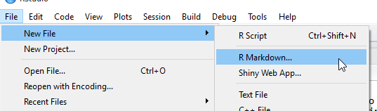

```{r setup, include=FALSE}
knitr::opts_chunk$set(collapse=TRUE, result="hold")
```


In this Lab I will show you some R workflow basics, which include saving and loading data, some R object types, subsetting data. We will also learn to make a boxplot. Finally, I will introduce an efficient way to make R programming reports in R Markdown.

## Working directory
To import or export a file from your computer, you need to set R's working directory to where the file's location. The ```getwd()``` functions prints the current working directory

```{r, eval=FALSE}
getwd()
```

To set working directory, use the ```setwd()``` function.

```{r, eval=FALSE}
setwd("..."")
```

The "..." part defines the target directory path. For example, if I want to set the working directory to ```D:/RFiles/Lab2```, use ```setwd("D:/RFiles/Lab2")```. Alternatively, you can set the working directory from RStudio.


Don't forget to change the Files pane as well, so you can keep track of what is going on in the folder.


## Importing data

Most of the data you will find online are in one of the two formats: .txt or .csv (comma separated values). Once the working directory is set to the file location, we can read the data into R by ```read.table()``` or ```read.csv()```. Here I will demonstrate the process with the ```txhousing``` data from ggplot2 exported as a .csv file. You can find the .csv file from Blackboard.

```{r}
data.txhousing <- read.csv("txhousing.csv", header=TRUE, stringsAsFactors=FALSE)
```

A function in R like ```read.csv()``` can often take multiple argument inputs. Please check help file on ```read.csv()```. In this example, the first argument of ```read.csv``` is ```file="txhousing.csv"```. An argument name can be omitted as long as the input arguments position matches the function default. In this case R automatically supply ```"txhousing.csv"``` to ```file```, which is the first argumnent of ```read.csv()```. One thing to note is that ```file``` does not have a default, so it has to be specified each time ```read.csv()``` is called.

The next argument ```header``` is defaulted by ```header=TRUE```, as can be seen in the help file. Indeed, the following line works just fine.

```{r}
data.txhousing <- read.csv("txhousing.csv", stringsAsFactors=FALSE)
```

Adding ```stringsAsFactors=FALSE``` is not required but is recommended. Most R users have ran into a mysterious bug at some point due to the fact that ```stringsAsFactors``` is defaulted to be ```TRUE```. I will show you why when we get to the  modeling part. 

The .csv file is thus read into R environment as an object named ```data.txhousing``` with the assignment operator ```<-```. You can also use ```=``` for assignments, but there is a subtle difference between the two. Most of the time using ```=``` for assignment is not an issue, so just pick one that you prefer and stick to it. RStudio has a keyboard shortcut Alt+ - (minus sign) for inserting ```<-```.

## Basic commands

R can be used as a calculator:
```{r}
1 / 10 * 30
(29 - 291 + 83) / 32
exp(2*sin(0.3*pi))
```

You can save objects by assigning names to it. For example,
```{r,}
x <- 1 / 10 * 30
y <- (29 - 291 + 83) / 32
x + y
x * y
```

Object names can only contain letters, numbers, ```_``` and, ```.```. No dash or space! You can name your objects in a more descriptive manner. 


```{r, eval=FALSE}
use_snake_case_convention
orCamelCase
periods.works.too
Dont.Do_somthingLike_this
```

R is also case-sensitive.

```{r}
a <- 10
A <- 3
a == A
```

Here we see a new operator ```==```, which is one of the logical operators in R. They are used to compare two objects and output a logical vector with values in ```TRUE``` and ```FALSE```. We will encounter more of them in Lab 3.

## Object types

So far the objects are all single numbers. A number is stored in the working environment as either an integer or a double. Those are examples of a numeric object. Different object are used for different tasks in R. I will go through some common data types and the basic commands associated with them one by one. The simplest way to check the type of an object is with the ```str()``` function, which prints out the object type and the first few values. A function that prints less is ```class()```.

### Vectors (Numeric/Character/Logical)

A basic one dimensional object in R is a vector. A vector is created with ```c()``` (combine). Fill in the values and R will choose the data type accordingly.
```{r}
vec_int <- c(1,2,3,4,5) # integer vector
vec_num <- c(2.5,1/3,sqrt(2),pi,exp(1)) # double vector
vec_chr <- c("character","vector","of","length","5")
vec_logical <- c(TRUE,FALSE,FALSE,TRUE,TRUE)
vec_int
vec_num
vec_chr
vec_logical
```
Let's check the class of above vectors with ```str()```.
```{r}
str(vec_int)
str(vec_num)
str(vec_chr)
str(vec_logical)
```

We can also form new vectors by combining existing ones with ```c()```. However, the data type of the new vector will be coerced to a common type.

```{r}
c_int_logical <-  c(vec_int,vec_logical)
str(c_int_logical) # Note that TRUE FALSE were converted to 1 and 0, respectively.
c_logical_chr <- c(vec_chr,vec_logical)
str(c_logical_chr)
```

The ```length()``` function gives you the length of a vector, which can be useful in controlling a process like a for loop.

```{r}
length(vec_int)
```

To extract the value(s) of a vector, specify the location of value(s) by a numeric vector with the extracting operator ```[]```. Run ```?"["``` to read help file on extraction.

```{r}
vec_int[5]
vec_num[c(3,1,2)]
vec_logical[c(2,1)]
```

One thing to note here is an extracted object inherits its ancestor's data type, so they can be used to supply function argument calls.

```{r}
str(vec_num[c(3,1,2)])
str(vec_logical[c(2,1)])
```

### Data Frames

Data frame is the signature R object type. A data frame is basically a list of vectors that share the same length. When we use ```read.csv()```, the output is stored as a data frame. The advantage of a data frame is we can assign column names to keep track of the attributes.

```{r}
str(data.txhousing)
```

To create a data frame from scratch, use ```data.frame()```. Let's use the vectors from before.

```{r}
newframe <- data.frame(x=vec_int, 
                       width=vec_num, 
                       description=vec_chr, 
                       logical=vec_logical)
newframe
```

We can check the size of a data frame with ```dim()```. In this example, the truncated Texas housing data has 1122 observations with 10 attributes.

```{r}
dim(data.txhousing)
```

To extract a subset of data frame, use the extracting operator ```[]``` just like extracting vectors. However, two arguments need to be specified this time as the corresponding row and column number. In the following example, ```c(1:5)``` creates a vector of integers from 1 to 5. You can also subset the columns by a character string. We will zoom in on data frame manipulations in Lab 3 with the introduction of package dplyr. 

```{r}
data.txhousing[2,2]
data.txhousing[c(1000:1005),c(1:5)]  # subset row 1000 to 1005, column 1 to 5.
data.txhousing[c(1000:1005),c("X","city","year","month")]
```

Use ```$``` To extract just one column from a data frame *as a vector*.
```{r, eval=FALSE}
data.txhousing$city
```

Be careful when subsetting columns from a data frame. In the following chunk, the first line gives a object whose type is different from the other two, even though the data seem to be the same!

```{r}
str(data.txhousing["city"])
str(data.txhousing[,"city"])
str(data.txhousing$city)
```

### Factors
R has a special data type to deal with categorical variables called factors. Factors are variables that have a fixed and known set of values. The most important part of a factor is its levels, which records the possible values it can take, and all other values will be converted to ```NA```. ```NA``` are missing values and one should always be careful when dealing with them. I will talk more about factors when we get into categorical data analysis. For now just be aware of their existence.

```{r}
sport <-c("soccer", "basketball", "lacrosse", "soccer", "soccer", "lacrosse")
sport.f <- factor(sport, levels=c("basketball", "soccer", "lacrosse"))
sport.f2 <- factor(sport, levels=c("basketball", "soccer"))
sport
sport.f
sport.f2
```

## Descriptive statistics

One quick way to quickly summarize a data frame (or a vector) is using the ```summary()``` function, which prints out basic descriptive statistics of numeric columns.

```{r}
summary(data.txhousing)
```

We can also compute specific statistics of numeric vectors with built-in functions.

* ```mean(x)```: mean of the vector ```x```
* ```var(x)```: variance of the vector ```x```
* ```sd(x)```: standard deviation of the vector ```x```
* ```quantile(x)```: quantiles of the vector ```x```

Most of the built-in statistical functions need to throw away NAs (missing values) to run by setting ```na.rm=TRUE```. For example, ```quantile(data.txhousing$volume)``` causes an error but ```quantile(data.txhousing$volume, na.rm=TRUE)``` does not. Another possibility is having NAs showing up in unwanted places:

```{r}
mean(data.txhousing$volume)
mean(data.txhousing$volume, na.rm=TRUE)
```

## Boxplot and violin plot

Boxplot is a widely used plot that can visualize the descriptive statistics shown in the ```summary()``` call. It is a bivariate graphic created in ggplot2 with the geom ```geom_boxplot()```. One advantage of ggplot2 is we can assign the layers to an object, so we can quickly cycle through geom options to find the most suitable one.

```{r, collapse=FALSE, results="markup", message=FALSE}
library(ggplot2)
plot.city <- ggplot(data=data.txhousing, aes(x=city, y=median))
plot.city + geom_boxplot()
```

A boxplot is a good way to plot a normally distributed data (bell curve). However, if the data does not look like a bell curve, say it has two peaks, then a good plotting alternative to use is the violin plot. In ggplot2, violin plots uses the geom ```geom_violin()```. Because we have saved the first layer of ggplot2 in ```plot.city```, we just need to stack a new geom on top of it.

```{r, collapse=FALSE, results="markup", message=FALSE}
plot.city + geom_violin()
```

## Saving your objects/plots

There are different ways to save objects from R environment. One common apporach is the ```save()``` function which saves R data into a .RData file. Another useful function is the ```saveRDS()```. Please refer to their help files since we will not use them here. I will only demonstrate how to export a data frame into a .csv file and a plot into .png.

```{r}
write.csv(data.txhousing, file="new_txhousing.csv") # save data.txhousing into a .csv file in working directory

plot.city.violin <- plot.city + geom_violin() # create a ggplot2 object
ggsave("city_violin.png", plot = plot.city.violin)

```

## Appendix: R Markdown

Markdown is a widely used text formatting language that has become standard in popular online communities like Reddit, StackExchange, and GitHub. This [video](http://rmarkdown.rstudio.com/lesson-1.html) from RStudio gives an overview for R Markdown. I use R Markdown to typeset all my R notes, and I encourage you to give it a try. 

Make sure that you installed the ```rmarkdown``` package. RStudio has built-in support for Rmarkdown files (.Rmd), and you can create a blank document from the tab.



An R Markdown file has three basic sections: Metadata, texts, and code chunks. The metadata controls the overall style and file format of document.

```{}
---
title: "Lab 2: R Basics"
author: "Chang-Hsin Lee"
date: "September 12, 2016"
output: html_document
  theme: spacelab
---

```

The text part is just regular text, but you can change the format of texts by adding special symbols like * or # in front of a line of text. [Here](http://rmarkdown.rstudio.com/lesson-8.html) is a good example of Markdown basics.

The code chunk part is delimited by ``` ```{r} ``` and ``` ``` ```. You can also use the shortcut Ctrl + Alt + I (OSX: Cmd + Alt + I). Between the backticks are where all R codes go in. R Markdown will run the code and display result in the output file. Code chunks have options for customized output. For example, ``` ```{r, echo=FALSE}``` means the R code will not be included in the output. ``` ```{r, warning=FALSE} ``` means the warnings will be suppressed. 

Once you have your document ready, either press the Knit button in RStudio


or use the render function from ```rmarkdown``` package. (Make sure the working directory is correct.)
```{r, eval=FALSE}
render("MyFirstMarkdown.Rmd")
```

If you feel I am giving too little instructions on making a Markdown file, start typing something now! The idea behind it is to make typing easy, so it really is not complicated at all, just give it a try. [R Markdown Cheatsheet](http://www.rstudio.com/wp-content/uploads/2016/03/rmarkdown-cheatsheet-2.0.pdf) is an extremely useful reference that will answer most of your Markdown questions. 

R Markdown can produce presentation slides in .html format. If you want to create a .pdf file (not recommended) instead of .html, you will also need to install [LaTex](http://miktex.org/) and [Pandoc](http://pandoc.org/) then put ```output: pdf_document``` in the header.


<!--- ## Useful commands
str()
length()
dim()
summary()
dput()
with()
apply() --->