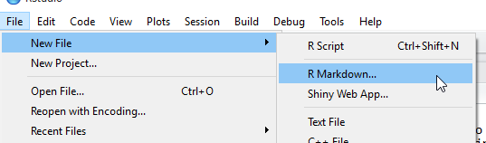
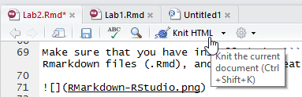

```{r setup, include=FALSE}
knitr::opts_chunk$set(collapse=TRUE, result="hold")
```

Inputs {.sidebar}
---------------------------------------------

Column
---------------------------------------------

### Basic commands

R can be used as a calculator:
```{r}
1 / 10 * 30
(29 - 291 + 83) / 32
exp(2*sin(0.3*pi))
```

You can save objects by assigning names to it. For example,
```{r,}
x <- 1 / 10 * 30
y <- (29 - 291 + 83) / 32
x + y
x * y
```

Object names can only contain letters, numbers, ```_``` and, ```.```. No dash or space! You can name your objects in a more descriptive manner. 


```{r, eval=FALSE}
use_snake_case_convention
orCamelCase
periods.works.too
Dont.Do_somthingLike_this
```

R is also case-sensitive.

```{r}
a <- 10
A <- 3
a == A
```

Here we see a new operator ```==```, which is one of the logical operators in R. They are used to compare two objects and output a logical vector with values in ```TRUE``` and ```FALSE```. We will encounter more of them in Lab 3.


### Appendix: R Markdown

Markdown is a widely used text formatting language that has become standard in popular online communities like Reddit, StackExchange, and GitHub. This [video](http://rmarkdown.rstudio.com/lesson-1.html) from RStudio gives an overview for R Markdown. I use R Markdown to typeset all my R notes, and I encourage you to give it a try. 

Make sure that you installed the ```rmarkdown``` package. RStudio has built-in support for Rmarkdown files (.Rmd), and you can create a blank document from the tab.



An R Markdown file has three basic sections: Metadata, texts, and code chunks. The metadata controls the overall style and file format of document.

```{}
---
title: "Lab 2: R Basics"
author: "Chang-Hsin Lee"
date: "September 12, 2016"
output: html_document
  theme: spacelab
---

```

The text part is just regular text, but you can change the format of texts by adding special symbols like * or # in front of a line of text. [Here](http://rmarkdown.rstudio.com/lesson-8.html) is a good example of Markdown basics.

The code chunk part is delimited by ``` ```{r} ``` and ``` ``` ```. You can also use the shortcut Ctrl + Alt + I (OSX: Cmd + Alt + I). Between the backticks are where all R codes go in. R Markdown will run the code and display result in the output file. Code chunks have options for customized output. For example, ``` ```{r, echo=FALSE}``` means the R code will not be included in the output. ``` ```{r, warning=FALSE} ``` means the warnings will be suppressed. 

Once you have your document ready, either press the Knit button in RStudio



or use the render function from ```rmarkdown``` package. (Make sure the working directory is correct.)
```{r, eval=FALSE}
render("MyFirstMarkdown.Rmd")
```

If you feel I am giving too little instructions on making a Markdown file, start typing something now! The idea behind it is to make typing easy, so it really is not complicated at all, just give it a try. [R Markdown Cheatsheet](http://www.rstudio.com/wp-content/uploads/2016/03/rmarkdown-cheatsheet-2.0.pdf) is an extremely useful reference that will answer most of your Markdown questions. 

R Markdown can produce presentation slides in .html format. If you want to create a .pdf file (not recommended) instead of .html, you will also need to install [LaTex](http://miktex.org/) and [Pandoc](http://pandoc.org/) then put ```output: pdf_document``` in the header.


<!--- ## Useful commands
str()
length()
dim()
summary()
dput()
with()
apply() --->