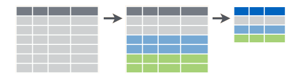

```{r setup, include=FALSE}
knitr::opts_chunk$set(echo = TRUE, collapse=TRUE, result="hold")
```

In this Lab I will show you another popular R package by Hadley Wickham: dplyr, that has greatly improved the workflow of R programming in the last few years. 

## R package: dplyr

```{r, warning=FALSE, message=FALSE}
library(dplyr)
```

dplyr is a data transformation package developed by Hadley Wickham to make everyday data wrangling tasks more efficient and more readable. There is another data transformation package, data.table, that provides a faster runtime and even more versatile than dplyr, but takes considerably more effort to learn, so I will be showing dplyr only. If your data takes up less than a few gigabytes, the speed gain from using data.table is insignificant compared to dplyr.

There are five key verbs in the dplyr:

* Pick variables by names with `select()`
* Pick observations by values with `filter()`
* Reorder the rows by `arrange()`
* Create new variables from existing ones with `mutate()`
* Collapse many values into a new summary variable with `summarize()`

(Hadley Wickham is from New Zealand so he uses `summarise()` instead of `summarize()`.)

## Data: NBA shot logs

The dataset that I am demonstrating here is the [NBA shot logs](https://www.kaggle.com/dansbecker/nba-shot-logs) from Kaggle. It contains a partial basketball shooting data in the NBA 2014-15 season. You can download the latest version from Kaggle or use the one I put on Blackboard. 

```{r}
nba.shots <- read.csv("shot_logs.csv", stringsAsFactors=FALSE)
glimpse(nba.shots)
```

This dataset contains a lot of observations (128069) and variables (21), but I will use only a subset of the data. Let's say that I want to compare shooting metrics of two players, Kobe Bryant and James Harden. In particular, I want to list for each game, their `POINTS` per `TOUCH_TIME`, then arrange the result in a descending order to find their most efficient game shooting performance during 14-15 season.

## select()

There are many variables in the basketall data and most of which I do not need to in comparing points per touch time. Sometimes the dataset will contain thousands of variables which with only a handful that are relevant to analysis. In this case, `select()` can quickly subset the variables you want to use in analysis. An easy way to remember is `select()` makes vertical slices on data.


```{r}
data.nba <- select(nba.shots, GAME_ID, player_name, MATCHUP, PERIOD, SHOT_NUMBER, TOUCH_TIME, PTS) # take only relevant columns
glimpse(data.nba)
```

## filter()

While `select()` makes vertical slices on data, `filter()` makes horizontal slices. How does R know which slices to take? Because each row in the data frame represents an observation, making horizontal slices means we are finding a subset of observations based on some filtering criteria. This is what `filter()` does. Here I keep only shot logs of two players, Kobe Bryant and James Harden by filtering on `player_name`. (The `%in` operator is a shorthand of `match()` that returns a logical vector and is `TRUE` when the vector on left mathces any of the value on the right. See `?match` for more information.)


```{r}
data.nba <- filter(data.nba, player_name %in% c("kobe bryant","james harden"))
glimpse(data.nba)
```

By using logical operators in R, you can combine several filtering statements into one. Please google "r logical operators" to learn more on how to write more complicated logical statements in R. The most common ones are

* & : AND
* | : OR
* ! : NOT

For example, we can keep only shots made by Kobe and James only in the 3rd and 4th quarters.
```{r}
data.nba.filter <- filter(nba.shots, 
                          player_name %in% c("kobe bryant","james harden") & (PERIOD == 3 | PERIOD == 4))
# Alternatively
data.nba.filter <- filter(nba.shots, 
                          player_name %in% c("kobe bryant","james harden") & PERIOD >= 3)

```

## mutate()

I have showed two functions for data trimming. What if I want to add more columns to the data? It is done with ```mutate()```, which creates new columns from existing columns. Here, I would like to know the total ```TOUCH_TIME``` each player has accumulated in game when they made the shot. If I want to use an aggregate function that sums entries cumulatively, I can't use it on the whole dataset, because that will aggregate all shots in the season. Insead, I need to group the data by game and by player to make sure the computation is only carried out within each group and not the whole season. 


### group_by()

```group_by()``` changes the scope of R functions so they only operate within subsets (groups) of data instead of the whole. It modified our data frame into a grouped data frame (a dplyr object). Here the grouping variables are ```GAME_ID``` and ```player_name```.

```{r}
data.nba <- group_by(data.nba, GAME_ID, player_name)
data.nba
```

To aggregate ```TOUCH_TIME``` now, I use a cumulative summing function ```cumsum()``` in conjunction with ```mutate()```. There are many useful function in R that creates new columns. Please read section 5.5.1 in [R for Data Science](http://r4ds.had.co.nz/transform.html#grouped-mutates-and-filters) if you want to learn more. I will list some them here.

* Arithmetic operators: ```+```, ```-```, ```*```, ```/```, ```^```. They are vectorized functions that recycles vector when one vector is shorter than the other. For example, ```SHOT_DIST * .3048``` converts shot distance to meters.
* Logarithmic: ```log()```, ```log2()```, ```log10()```.
* Offsets: ```lead()``` and ```lag()``` shifts the vector forward or backward. Very useful in computing running difference in time series.
* Cumulative aggregates: ```cumsum()```, ```cumprod()```, ```cummin()```, ```cummax()```, ```cummean()```.
* Ranking: ```min_rank()```, ```row_number()```, etc.

```{r}
data.nba <- mutate(data.nba, total_time = cumsum(TOUCH_TIME))
glimpse(data.nba)
```
Try running the above command without grouping the variables and see what happens.

### ifelse()

Sometimes it is helpful to have a column of only values 0 and 1 ready as an intermediate step of a computation task. To create such variables, R has a vectorized function that allows user to avoid an if-else loop called ```ifelse()```. The function ```ifelse()``` takes three arguments. The first is a logical statement. If the first argument is ```TRUE```, then it returns the value in the second argument, otherwise returns the value in third argument. Missing values (```NA```) will also resulted in ```NA```. 

I can create a column ```MADE``` where ```1``` means the player made basket and ```0``` as missed. (This is in fact already present in the original data called ```FGM```.) 

```{r}
data.nba <- mutate(data.nba, MADE = ifelse(PTS == 0, 0, 1))
glimpse(data.nba)
```

This kind of variable is convenient whenever we want to aggregate the data. For example, by summing up all the 1's, I can count how many shots a player has made over the course of a season. But how can we compute the sum by player? dplyr provides another powerful verb called ```summarize()```.

## summarize()

Once we created a grouped data, a common thing to do is to compute various statistics within each group. Here my goal is to get points per touch time in each game. In order to do so, I need a variable of total touch time of a player in each game called ```total_touch```, and a variable of total points ```total_pts```. Next, I divide ```total_pts``` by ```total_touch``` to obtain the per time stat I need. The new data frame should have less observations than the original one because we have condensed the data by a per game basis. Whenever I am collapsing the data while computing new columns, I use ```summarize()```. The variables in the new data frame are the grouping variables plus the summary variables. 



```{r}
summary.nba <- summarize(data.nba, 
                         total_shots = n(),
                         total_touch = max(total_time),
                         total_pts = sum(PTS),
                         pts_per_time = total_pts / total_touch)
glimpse(summary.nba)
```

```summarize()``` is almost always accompanied with ```group_by()```. Here is a list of some useful summary functions 

* ```mean()```,```median()```,```sd()``` compute the mean, median, and standard deviation of data.
* ```n()```, ```n_distinct()``` find the count and unique count of data. 
* Measure of rank like ```min()```, ```max()```, ```quantile(x,0.25)```. For example, ```quantile(x,0.25)``` finds a 25th percentile value of ```x```.

As a quick example, we can count how many players are included in our data and their expected points for each shot.

```{r}
data.player <- group_by(nba.shots, player_name)
num.player <- summarize(nba.shots,
                        num_players = n_distinct(player_name),
                        total_attempts = n())
num.player
exp.pts <- summarize(data.player,
                     count = n(),
                     exp_pts = mean(PTS))
head(exp.pts)
```

## arrange()

Now I have the ```pts_per_time``` variable that I wanted in the beginning, I can use ```arrange()``` to sort my data. 
```{r}
summary.nba <- arrange(summary.nba, desc(pts_per_time))
head(summary.nba)
```
If you put multiple arguments in ```arrange()```, it will sort variables with higher priority from left to right. ```arrange()``` is defaulted to sort in ascending order, and only sorts in descending order if ```desc()``` is specified.


## %>% : Pipe

So far, we created an intermediate object in our script for each passing to a function. Naming is difficult and time-consuming, and it is easy to lose track of which data frame we are using in the function.

```{r, eval=FALSE}
data.nba <- select(nba.shots, GAME_ID, player_name, MATCHUP, PERIOD, SHOT_NUMBER, TOUCH_TIME, PTS_TYPE, SHOT_RESULT, PTS)
data.nba <- filter(data.nba, player_name %in% c("kobe bryant","james harden"))
data.nba <- group_by(data.nba, GAME_ID, player_name)
data.nba <- mutate(data.nba, total_time = cumsum(TOUCH_TIME))
summary.nba <- summarize(data.nba, 
                         total_shots = n(),
                         total_touch = max(total_time),
                         total_pts = sum(PTS),
                         pts_per_time = total_pts / total_touch)
summary.nba <- arrange(summary.nba, desc(pts_per_time))
```

The data transformation process can also be done by nesting all functions. This is frustrating to write and even more frustrating to read.

```{r, eval=FALSE}
data.nba <- mutate(
              group_by(
                  filter(
                    select(nba.shots, GAME_ID, player_name, MATCHUP, PERIOD, SHOT_NUMBER, TOUCH_TIME, PTS_TYPE, SHOT_RESULT, PTS),
                  player_name %in% c("kobe bryant","james harden")),
                  GAME_ID, player_name),
              total_time = cumsum(TOUCH_TIME))

summary.nba <- arrange(
                summarize(data.nba, 
                           total_shots = n(),
                           total_touch = max(total_time),
                           total_pts = sum(PTS),
                           pts_per_time = total_pts / total_touch),
                desc(pts_per_time))
```

Can we avoid naming intermediate object without nesting all the functions? dplyr took an operator ```%>%``` (read THEN) from another package, magrittr, for this exact purpose.```%>%``` is a piping operator which feeds the object on the left hand side to the first argument of function on the right hand side. If we have a linear data transforming task like what we have done here, proper piping removes clutter in code and improves readability.

```{r, eval=FALSE}
summary.nba2 <- nba.shots %>%
  select(GAME_ID, player_name, MATCHUP, SHOT_NUMBER, TOUCH_TIME, SHOT_DIST, PTS_TYPE, SHOT_RESULT, PTS) %>%
  filter(player_name %in% c("kobe bryant","james harden")) %>%
  group_by(GAME_ID, player_name) %>%
  mutate(total_time = cumsum(TOUCH_TIME)) %>%
  summarize(total_shots = n(),
            total_touch = max(total_time),
            total_pts = sum(PTS),
            pts_per_time = total_pts / total_touch) %>%
  arrange(desc(pts_per_time))

View(summary.nba2)
```

If you want to pass the object on the left to somewhere other than the first argument, you can specify the position with a period ".":

```{r, eval=FALSE}
object %>% some_function(arg1, arg2=.) # pass object to the second argument of some_function
```

## Cheat sheet

Make sure you check out the extremely helpful [dplyr cheat sheet](https://www.rstudio.com/wp-content/uploads/2015/02/data-wrangling-cheatsheet.pdf).

